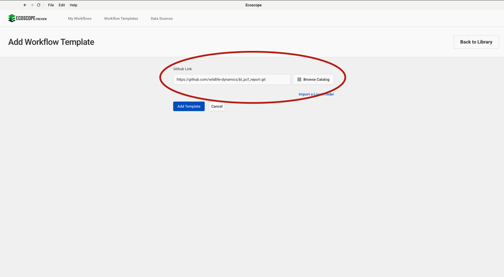
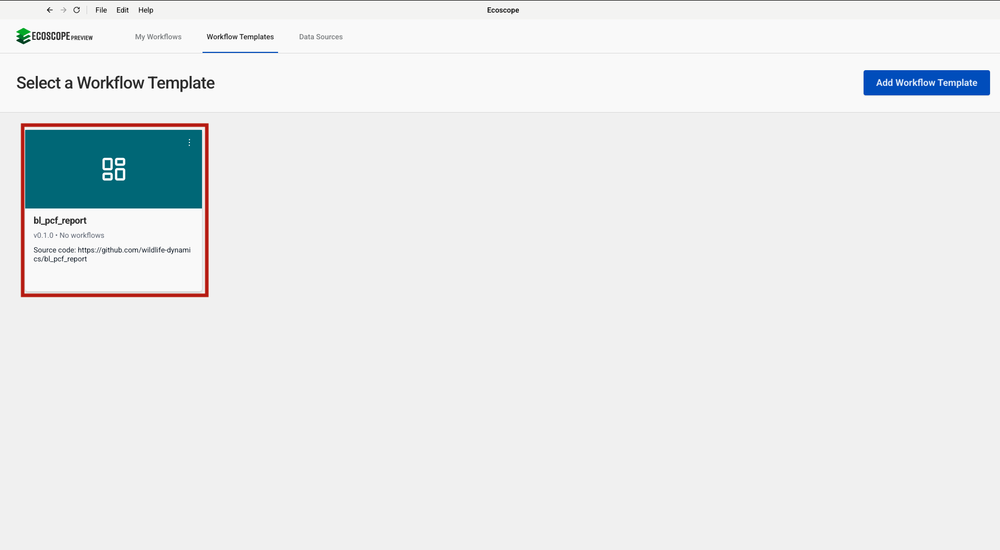
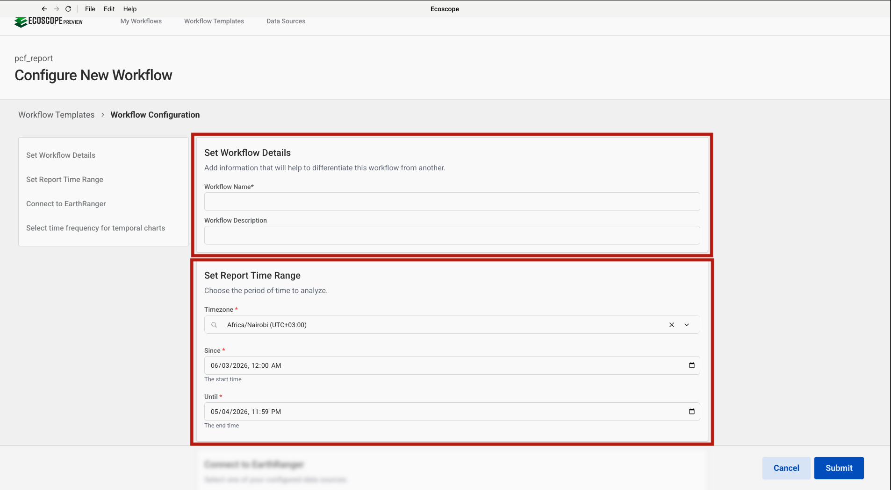
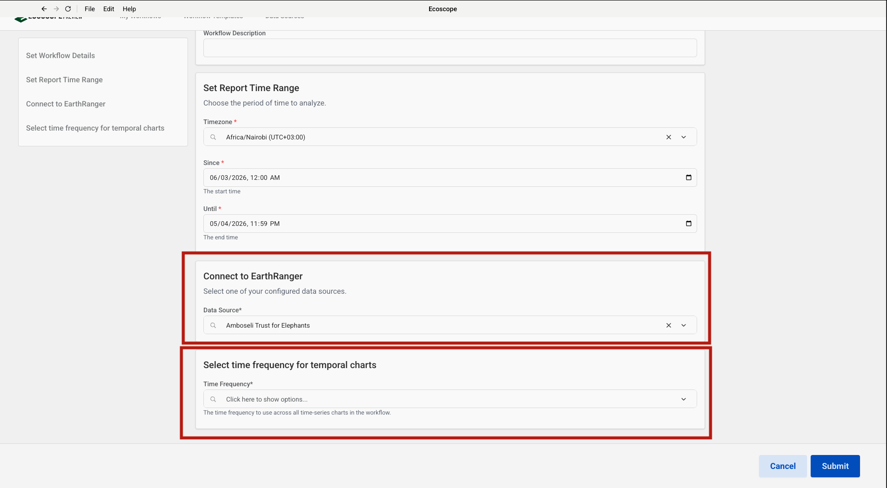

# BL PCF Report — User Guide

This guide walks you through configuring and running the Big Life PCF Report workflow, which ingests livestock predation events from EarthRanger and produces a comprehensive Predator Compensation Fund incident analysis report for the Amboseli ecosystem.

---

## Overview

The workflow delivers, for each run:

- **Charts** — pie charts by predator, ranch, and attack location; stacked bar charts by claim type and predator; time-of-day bar chart; multi-line and multi-bar time-series charts; and per-ranch historic comparison charts
- **Maps** — predation incident density grid, boma-attack density grid, and livestock species scatter map
- **Summary tables** — overall predation summary, per-ranch summaries, claim-type breakdown, predator breakdown, location analysis, and boma incident statistics
- A **Word document report** — all charts, maps, and tables assembled into the Big Life PCF report template

---

## Prerequisites

Before running the workflow, ensure you have:

- Access to an **EarthRanger** instance with `hwc_lvstprd` livestock predation events logged for the analysis period

---

## Step-by-Step Configuration

### Step 1 — Add the Workflow Template

In the workflow runner, go to **Workflow Templates** and click **Add Workflow Template**. Paste the GitHub repository URL into the **Github Link** field:

```
https://github.com/wildlife-dynamics/bl_pcf_report.git
```

Then click **Add Template**.



---

### Step 2 — Add an EarthRanger Connection

Navigate to **Data Sources** and click **Connect**. Select **EarthRanger** from the data source type dialog, then fill in the connection form:

- **Data Source Name** — a label to identify this connection
- **EarthRanger URL** — your instance URL (e.g. `your-site.pamdas.org`)
- **EarthRanger Username** and **EarthRanger Password**

> Credentials are not validated at setup time. Any authentication errors will appear when the workflow runs.

Click **Connect** to save.


---

### Step 3 — Select the Workflow

After the template is added, it appears in the **Workflow Templates** list as **bl_pcf_report**. Click it to open the workflow configuration form.

> The card may show **Initializing…** briefly while the environment is set up.



---

### Step 4 — Set Workflow Details and Report Time Range

The configuration form opens with two sections at the top.

**Set Workflow Details**

| Field | Description |
|-------|-------------|
| Workflow Name | A short name to identify this run |
| Workflow Description | Optional notes (e.g. month, ranch, or reporting period) |

**Set Report Time Range**

| Field | Description |
|-------|-------------|
| Timezone | Select the local timezone (e.g. `Africa/Nairobi UTC+03:00`) |
| Since | Start date and time of the analysis period |
| Until | End date and time of the analysis period |

All livestock predation events are fetched within this window. The analysis covers incidents from the three target ranches — Eselengei, Mbirikani, and Kimana — restricted to valid claims only.



---

### Step 5 — Connect to EarthRanger and Select Time Frequency

Scroll down to configure the final two sections.

**Connect to EarthRanger**

Select the EarthRanger data source configured in Step 2 from the **Data Source** dropdown (e.g. `Amboseli Trust for Elephants`).

**Select time frequency for temporal charts**

Choose the temporal aggregation unit used by all multi-line and multi-bar time-series charts in the report:

| Option | Description |
|--------|-------------|
| **Annual** | Aggregate by year — best for multi-year trend comparisons |
| **Monthly** | Aggregate by calendar month |
| **Weekly** | Aggregate by ISO week number |
| **Daily** | Aggregate by individual day |

Select **Annual** to generate year-over-year historic comparison charts per ranch.



---

## Running the Workflow

Once all parameters are configured, click **Submit**. The runner will:

1. Download the Amboseli land-use, ranch boundary, and electric fence layers from Dropbox.
2. Fetch `hwc_lvstprd` events from EarthRanger for the specified time range.
3. Normalise event details (field titles, numeric conversions, missing value handling).
4. Filter events to Eselengei, Mbirikani, and Kimana ranches with valid claims only.
5. Compute overall and per-ranch summary tables (incidents, livestock killed, compensation value).
6. Generate all charts and persist as HTML and PNG.
7. Generate the predation density map, boma density map, and livestock species scatter map.
8. Look up the current EarthRanger user's name for report attribution.
9. Populate the Big Life PCF Word template with all outputs.
10. Save all files to the directory specified by `ECOSCOPE_WORKFLOWS_RESULTS`.

---

## Output Files

All outputs are written to `$ECOSCOPE_WORKFLOWS_RESULTS/`:

| File | Description |
|------|-------------|
| `livestock_killed_by_predator_pie.html` / `.png` | Pie chart — livestock killed by predator species |
| `compensation_value_by_predator_pie.html` / `.png` | Pie chart — compensation value by predator species |
| `compensation_value_by_ranch_pie.html` / `.png` | Pie chart — compensation value by ranch |
| `livestock_attack_location_pie.html` / `.png` | Pie chart — attack location distribution |
| `boma_type_targeted_pie.html` / `.png` | Pie chart — boma type (Permanent vs Temporary) |
| `livestock_killed_by_claim_type_bar.html` / `.png` | Stacked bar — livestock killed by claim type × ranch |
| `claim_count_by_type_bar.html` / `.png` | Stacked bar — claim count by claim type × ranch |
| `livestock_killed_by_predator_pct_bar.html` / `.png` | 100% stacked bar — livestock killed % by predator × ranch |
| `predation_incidents_by_time_of_day_bar.html` / `.png` | Bar chart — incidents by time of day bin |
| `livestock_killed_over_time_by_ranch_chart.html` / `.png` | Multi-line — livestock killed over time by ranch |
| `livestock_killed_over_time_by_attack_location_chart.html` / `.png` | Multi-line — livestock killed over time by attack location |
| `claim_count_over_time_by_type_chart.html` / `.png` | Multi-line — claim count over time by claim type |
| `livestock_killed_over_time_by_predator_mulit_bar_chart.html` / `.png` | Multi-bar — animals killed per predator over time |
| `ranch_level_historic_time_series_chart_<ranch>.html` / `.png` | Historic comparison chart per ranch |
| `predation_incident_density_map.html` / `.png` | Density grid — all predation incidents |
| `boma_predation_density_map.html` / `.png` | Density grid — boma attacks only |
| `livestock_predation_event_map.html` / `.png` | Scatter map — livestock species |
| `big_life_pcf_report.docx` | Final populated Word PCF report |
